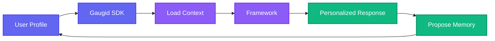

# Framework Integration Overview

This section provides **systematic tutorials** for integrating Gaugid SDK with popular AI agent frameworks. Each tutorial demonstrates the **same use case** (a personalized chatbot) implemented with different frameworks, making it easy to compare approaches and choose the right framework for your needs.

## The Common Use Case

All tutorials build a **personalized chatbot** that:

1. **Loads user context** from Gaugid profiles
2. **Personalizes responses** based on user preferences, expertise, and history
3. **Proposes memories** learned during conversations
4. **Respects consent policies** and privacy controls

## Supported Frameworks

| Framework | Best For | Tutorial | Memory Backend |
|-----------|----------|----------|----------------|
| **LangChain** | Chains and sequential workflows | [View →](frameworks/langchain.md) | - |
| **LangGraph** | State machines and complex flows | [View →](frameworks/langgraph.md) | ✅ `GaugidStore` |
| **OpenAI Assistants** | GPT-4 with persistent assistants | [View →](frameworks/openai-assistants.md) | - |
| **OpenAI Agents** | Agent SDK with sessions | - | ✅ `GaugidSession` |
| **Anthropic Claude** | Long context and reasoning | [View →](frameworks/anthropic.md) | ✅ `GaugidMemoryTool` |
| **Google Gemini** | Fast inference and multimodal | [View →](frameworks/gemini.md) | - |
| **Google ADK** | Production multi-agent systems | [View →](frameworks/google-adk.md) | ✅ `GaugidMemoryService` |
| **CrewAI** | Multi-agent teams and collaboration | [View →](frameworks/crewai.md) | - |
| **LlamaIndex** | RAG and document indexing | - | ✅ `GaugidMemoryBlock` |
| **Agno** | Enterprise multi-agent orchestration | [View →](frameworks/agno.md) | ✅ `GaugidDb` |
| **LangMem** | Automatic memory management | - | ✅ Works with `GaugidStore` |

## Integration Pattern

All frameworks follow the same integration pattern:



### Step 1: Load User Context

```python
from gaugid import GaugidClient

client = GaugidClient(connection_token="gaugid_conn_xxx")

# Load user profile with specific scopes
profile = await client.get_profile(
    user_did="did:a2p:user:gaugid:alice",
    scopes=["a2p:preferences", "a2p:professional", "a2p:context"]
)
```

### Step 2: Inject Context into Framework

Each framework has a different way to inject context:

- **LangChain**: System prompt in `ChatPromptTemplate`
- **LangGraph**: User context in state
- **OpenAI Assistants**: Instructions in assistant creation
- **Anthropic**: System message in message array
- **Google Gemini**: System instruction in generation config
- **CrewAI**: Backstory in agent definition
- **Agno**: Context in agent initialization

### Step 3: Propose Memories

```python
# After conversation, propose learned memories
await client.propose_memory(
    user_did="did:a2p:user:gaugid:alice",
    content="User is interested in Rust programming",
    category="a2p:interests.technology",
    confidence=0.8
)
```

## Comparison Matrix

| Feature | LangChain | LangGraph | OpenAI | Claude | Gemini | ADK | CrewAI | LlamaIndex | Agno |
|---------|-----------|-----------|--------|--------|--------|-----|--------|------------|------|
| **Context Injection** | System prompt | State | Instructions | System message | System instruction | Instruction | Backstory | Memory block | Init params |
| **Memory Management** | Custom class | State updates | Thread memory | Session memory | Session memory | Agent memory | Crew memory | Memory block | Shared memory |
| **Gaugid Memory Backend** | - | ✅ `GaugidStore` | ✅ `GaugidSession` | ✅ `GaugidMemoryTool` | - | ✅ `GaugidMemoryService` | - | ✅ `GaugidMemoryBlock` | ✅ `GaugidDb` |
| **Multi-Agent** | Manual | Graph nodes | Manual | Manual | Via ADK | ✅ Native | ✅ Crews | Manual | ✅ Teams |
| **State Management** | Chain state | Graph state | Thread state | Session | Session | Agent state | Crew state | Memory state | Team state |
| **Best For** | Simple chains | Complex flows | GPT-4 apps | Long context | Fast inference | Production | Research teams | RAG apps | Enterprise |

## Tutorial Structure

Each framework tutorial includes:

1. **Setup** - Install dependencies and configure API keys
2. **Profile Creation** - Create a user profile with preferences
3. **Context Loading** - Load user context from Gaugid
4. **Framework Integration** - Integrate with the framework
5. **Personalization** - Personalize responses based on context
6. **Memory Proposals** - Propose memories learned during conversation
7. **Complete Example** - Full working code

## Prerequisites

Before starting any tutorial, ensure you have:

1. **Python 3.10+** installed
2. **Gaugid SDK** installed: `pip install gaugid`
3. **Connection Token** from Gaugid (see [Authentication Guide](../../getting-started/authentication.md))
4. **Framework-specific dependencies** (see each tutorial)
5. **API Keys** for the LLM provider (OpenAI, Anthropic, Google, etc.)

## Next Steps

Choose a framework that matches your needs:

- **Simple chatbot?** → Start with [LangChain](frameworks/langchain.md)
- **Complex state machine?** → Try [LangGraph](frameworks/langgraph.md)
- **GPT-4 with threads?** → Use [OpenAI Assistants](frameworks/openai-assistants.md)
- **Long context?** → Check [Anthropic Claude](frameworks/anthropic.md)
- **Multi-agent system?** → See [CrewAI](frameworks/crewai.md) or [Google ADK](frameworks/google-adk.md)

---

**Ready to start?** Pick a framework and dive into the tutorial!
